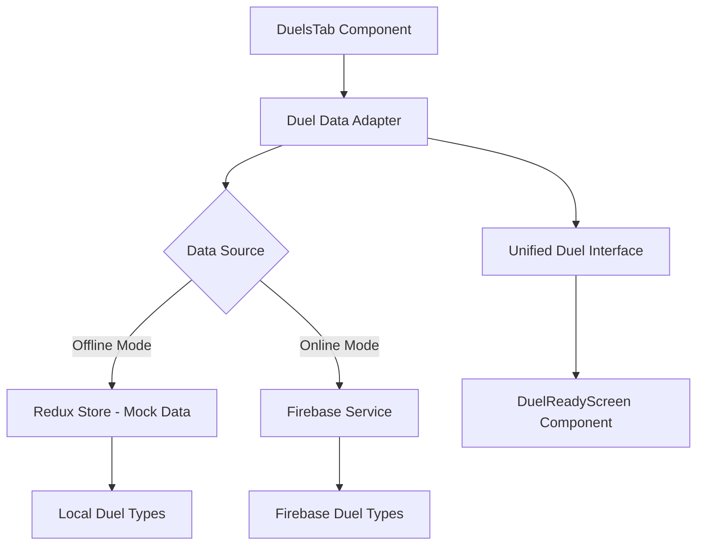
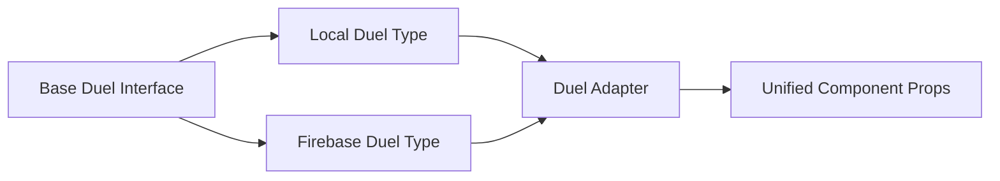

# Design Document

## Overview

This design addresses the duel system improvements for the OneMore fitness app. The main focus is on creating a robust, type-safe duel system that works seamlessly with both mock data (for development) and Firebase integration (for production), while providing users with sample duels to understand and test the functionality.

## Architecture

### Data Layer Architecture



### Type System Architecture



## Components and Interfaces

### 1. Duel Data Adapter

**Purpose:** Provides a unified interface for duel data regardless of the underlying data source.

**Key Methods:**

- `getDuel(id: string): Promise<UnifiedDuel>`
- `subscribeToDuel(id: string, callback: (duel: UnifiedDuel) => void): Unsubscribe`
- `createDuel(config: DuelConfig): Promise<DuelResult>`
- `joinDuel(id: string): Promise<DuelResult>`

**Implementation Strategy:**

- Use factory pattern to determine data source (offline vs online)
- Implement adapter pattern to convert between local and Firebase types
- Provide consistent error handling across both data sources

### 2. Unified Duel Interface

```typescript
interface UnifiedDuel {
  id: string;
  exercise: ExerciseType;
  status: DuelStatus;
  host: DuelParticipant;
  guest?: DuelParticipant;
  hostScore?: number;
  guestScore?: number;
  windowSec: number;
  createdAt: number;
  expiresAt: number;
  matchType: MatchType;
}

interface DuelParticipant {
  uid: string;
  username: string;
}
```

### 3. Sample Duel Generator

**Purpose:** Creates realistic sample duels for demonstration and testing purposes.

**Features:**

- Generates diverse exercise types and difficulty levels
- Creates duels in different states (pending, active, completed)
- Provides realistic opponent names and scores
- Ensures sample duels don't interfere with real duels

### 4. Enhanced DuelReadyScreen

**Improvements:**

- Better error handling for missing or invalid duel data
- Graceful fallbacks for offline mode
- Improved loading states and user feedback
- Type-safe props and data handling

## Data Models

### Mock Duel Data Structure

```typescript
interface MockDuelData {
  sampleDuels: UnifiedDuel[];
  userPreferences: {
    showSampleDuels: boolean;
    hasCreatedRealDuel: boolean;
  };
}
```

### Duel State Management

```typescript
interface DuelState {
  activeDuels: UnifiedDuel[];
  sampleDuels: UnifiedDuel[];
  isOfflineMode: boolean;
  dataSource: "mock" | "firebase";
  lastSyncTimestamp: number;
}
```

## Error Handling

### Error Categories

1. **Network Errors:** Firebase connection issues, timeout errors
2. **Data Validation Errors:** Invalid duel configurations, missing required fields
3. **State Errors:** Attempting to join expired duels, duplicate actions
4. **Type Errors:** Data format mismatches between sources

### Error Recovery Strategies

1. **Graceful Degradation:** Fall back to offline mode when Firebase is unavailable
2. **Retry Logic:** Automatic retry for transient network errors
3. **User Feedback:** Clear error messages with actionable next steps
4. **Data Validation:** Client-side validation before server requests

## Testing Strategy

### Unit Tests

1. **Duel Adapter Tests:**

   - Test type conversion between local and Firebase formats
   - Verify error handling for invalid data
   - Test offline/online mode switching

2. **Sample Duel Generator Tests:**

   - Verify generated duels have valid structure
   - Test diversity of generated content
   - Ensure no conflicts with real duels

3. **Component Tests:**
   - Test DuelReadyScreen with various duel states
   - Verify proper error display and loading states
   - Test user interactions and navigation

### Integration Tests

1. **Data Flow Tests:**

   - Test complete duel creation and joining flow
   - Verify data synchronization between offline and online modes
   - Test real-time updates and subscriptions

2. **Error Scenario Tests:**
   - Test behavior when Firebase is unavailable
   - Verify error recovery and fallback mechanisms
   - Test edge cases with malformed data

### User Acceptance Tests

1. **First-Time User Experience:**

   - Verify sample duels are displayed appropriately
   - Test duel creation and joining workflows
   - Ensure smooth transition from sample to real duels

2. **Offline/Online Transitions:**
   - Test app behavior when going offline/online
   - Verify data persistence and synchronization
   - Test user experience during connectivity changes

## Implementation Phases

### Phase 1: Type System Unification

- Create unified duel interfaces
- Implement duel data adapter
- Update existing components to use unified types

### Phase 2: Sample Duel System

- Implement sample duel generator
- Add sample duels to initial app state
- Create logic to show/hide sample duels

### Phase 3: Enhanced Error Handling

- Improve error handling in DuelReadyScreen
- Add better loading states and user feedback
- Implement retry mechanisms

### Phase 4: Testing and Validation

- Write comprehensive tests for all components
- Perform user acceptance testing
- Optimize performance and user experience

## Performance Considerations

1. **Lazy Loading:** Load duel data only when needed
2. **Caching:** Cache frequently accessed duel data
3. **Subscription Management:** Properly manage Firebase subscriptions to prevent memory leaks
4. **Bundle Size:** Minimize impact on app bundle size through code splitting

## Security Considerations

1. **Data Validation:** Validate all duel data on both client and server
2. **User Authentication:** Ensure only authenticated users can create/join duels
3. **Rate Limiting:** Prevent abuse of duel creation and joining
4. **Data Privacy:** Protect user data in duel interactions
