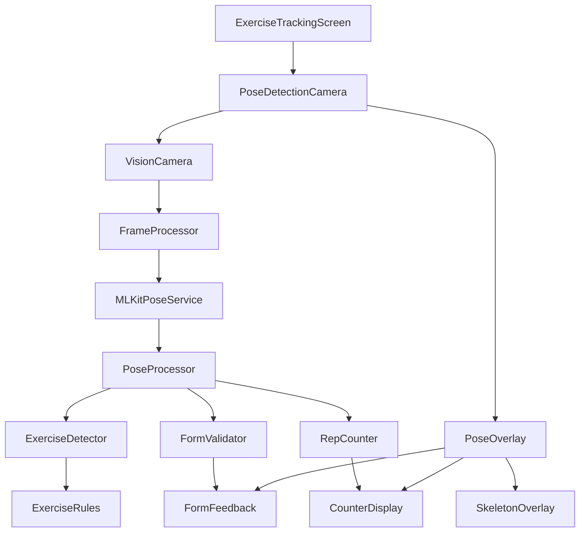

# Design Document

## Overview

The pose detection workout system will transform the existing manual exercise tracking into an intelligent, AI-powered experience using Google ML Kit for real-time pose analysis. The system will integrate seamlessly with the current ExerciseTrackingScreen while adding computer vision capabilities for automatic rep counting, form validation, and real-time feedback.

The design leverages react-native-vision-camera with ML Kit pose detection to provide on-device processing, ensuring privacy and offline functionality. The system will maintain the existing beautiful UI while enhancing it with pose detection overlays and intelligent feedback systems.

## Architecture

### High-Level Architecture



### Technology Stack

- **Camera**: react-native-vision-camera (replacing expo-camera for ML Kit compatibility)
- **ML Processing**: @react-native-ml-kit/pose-detection
- **Frame Processing**: react-native-reanimated worklets
- **State Management**: Redux Toolkit (existing)
- **UI Framework**: React Native with existing styling system

### Migration Strategy

The system will be implemented as an enhancement to the existing ExerciseTrackingScreen, allowing gradual rollout:

1. **Phase 1**: Add pose detection as optional feature alongside manual counting
2. **Phase 2**: Make pose detection the default with manual fallback
3. **Phase 3**: Full integration with enhanced UI and advanced features

## Components and Interfaces

### Core Components

#### 1. PoseDetectionCamera Component

```typescript
interface PoseDetectionCameraProps {
  exerciseType: ExerciseType;
  onRepDetected: (repData: RepData) => void;
  onFormFeedback: (feedback: FormFeedback) => void;
  onCalibrationComplete: (calibrationData: CalibrationData) => void;
  isActive: boolean;
  settings: PoseDetectionSettings;
}
```

**Responsibilities:**

- Manage camera lifecycle and permissions
- Process frames through ML Kit
- Coordinate pose detection pipeline
- Handle calibration process

#### 2. PoseOverlay Component

```typescript
interface PoseOverlayProps {
  poses: Pose[];
  formFeedback: FormFeedback | null;
  repCount: number;
  targetCount: number;
  showSkeleton: boolean;
  exerciseType: ExerciseType;
  renderMode: "full" | "minimal" | "markers-only";
}
```

**Responsibilities:**

- Render skeleton overlay on camera feed
- Display form feedback indicators
- Show rep counter and progress
- Provide visual guidance for camera positioning

**Render Modes:**

- **Full**: Complete skeleton with all joints and connections
- **Minimal**: Key joints only (shoulders, elbows, hips, knees)
- **Markers-only**: Simple dots at critical points for low-performance devices

#### 3. CalibrationScreen Component

```typescript
interface CalibrationScreenProps {
  exerciseType: ExerciseType;
  onCalibrationComplete: (data: CalibrationData) => void;
  onSkip: () => void;
}
```

**Responsibilities:**

- Guide user through calibration process
- Capture baseline measurements
- Validate camera positioning
- Store calibration data

### Service Layer

#### 1. MLKitPoseService

```typescript
class MLKitPoseService {
  static async detectPoses(frame: Frame): Promise<Pose[]>;
  static async initialize(): Promise<void>;
  static async cleanup(): Promise<void>;
  static isAvailable(): boolean;
}
```

**Responsibilities:**

- Interface with ML Kit pose detection
- Handle model initialization and cleanup
- Process camera frames
- Return pose landmark data

#### 2. PoseProcessor

```typescript
class PoseProcessor {
  processFrame(poses: Pose[], exerciseType: ExerciseType): ProcessedPoseData;
  calibrate(poses: Pose[], exerciseType: ExerciseType): CalibrationData;
  validatePose(pose: Pose, calibration: CalibrationData): ValidationResult;
}
```

**Responsibilities:**

- Process raw pose data from ML Kit
- Apply exercise-specific transformations
- Handle calibration logic
- Validate pose quality and completeness

#### 3. ExerciseDetector

```typescript
class ExerciseDetector {
  detectRep(
    poseHistory: Pose[],
    exerciseType: ExerciseType
  ): RepDetectionResult;
  getExerciseRules(exerciseType: ExerciseType): ExerciseRules;
  updateRepState(newPose: Pose): void;
}
```

**Responsibilities:**

- Implement exercise-specific detection algorithms
- Track movement phases (up/down, in/out)
- Determine when a valid rep is completed
- Maintain exercise state machine

**Rep Counting Algorithms:**

- **Push-ups**: Detected via elbow angle crossing 90° threshold (down) and returning to 160°+ (up)
- **Squats**: Detected via hip angle dropping below 90° and knee angle below 90° (down), returning to 160°+ (up)
- **Sit-ups**: Detected via torso angle changing from horizontal (0°) to 45°+ (up) and back
- **Planks**: Time-based holding detection with body alignment validation
- **Burpees**: Multi-phase detection combining squat-down, plank, push-up, squat-up, and jump phases

#### 4. FormValidator

```typescript
class FormValidator {
  validateForm(
    pose: Pose,
    exerciseType: ExerciseType,
    calibration: CalibrationData
  ): FormValidationResult;
  getFormFeedback(validationResult: FormValidationResult): FormFeedback;
  calculateJointAngles(pose: Pose): JointAngles;
}
```

**Responsibilities:**

- Analyze pose for proper form
- Calculate joint angles and body alignment
- Generate specific feedback messages
- Track form quality over time

## Data Models

### Core Types

```typescript
interface Pose {
  landmarks: PoseLandmark[];
  timestamp: number;
  confidence: number;
}

interface PoseLandmark {
  x: number;
  y: number;
  z?: number;
  visibility: number;
  type: LandmarkType;
}

interface RepData {
  count: number;
  timestamp: number;
  formScore: number;
  duration: number;
  phase: "up" | "down" | "hold";
}

interface FormFeedback {
  type: "good" | "warning" | "error";
  message: string;
  bodyParts: string[];
  severity: number;
  suggestions: string[];
  priority: number; // 1-10, higher = more important
}

interface CalibrationData {
  exerciseType: ExerciseType;
  userHeight: number;
  cameraAngle: number;
  baselinePose: Pose;
  jointRanges: JointRanges;
  timestamp: number;
  persistent: boolean; // Whether to save across sessions
  expiresAt?: number; // Optional expiration timestamp
}

interface ExerciseRules {
  keyLandmarks: LandmarkType[];
  movementPhases: MovementPhase[];
  formCriteria: FormCriteria[];
  repThresholds: RepThresholds;
  cameraPosition: CameraPosition;
}
```

### Exercise-Specific Models

```typescript
interface PushUpRules extends ExerciseRules {
  elbowAngleRange: [number, number];
  bodyAlignmentTolerance: number;
  minimumDepth: number;
}

interface SquatRules extends ExerciseRules {
  hipAngleRange: [number, number];
  kneeAngleRange: [number, number];
  minimumDepth: number;
  kneeAlignment: boolean;
}

interface PlankRules extends ExerciseRules {
  bodyLineDeviation: number;
  hipAlignment: number;
  shoulderAlignment: number;
  holdDuration: number;
}
```

## Feedback Priority Logic

When multiple events occur simultaneously, the system prioritizes feedback using the following hierarchy:

1. **Safety Issues (Priority 10)**: Joint stress, dangerous positions
2. **Form Corrections (Priority 7)**: Posture, alignment, range of motion
3. **Rep Validation (Priority 5)**: Rep counting, movement completion
4. **Encouragement (Priority 3)**: Motivational messages, progress updates

```typescript
class FeedbackManager {
  processFeedback(feedbacks: FormFeedback[]): FormFeedback {
    return feedbacks.sort((a, b) => b.priority - a.priority)[0];
  }

  // Example: If rep detected (priority 5) and form issue found (priority 7)
  // Form feedback takes precedence
}
```

## Calibration Persistence

CalibrationData storage strategy:

- **Per-session**: Default mode, calibration valid for current workout only
- **Persistent**: User can opt to save calibration per exercise type
- **Expiration**: Persistent calibrations expire after 7 days to account for environmental changes
- **Storage**: Local AsyncStorage with exercise-specific keys

## Error Handling

### Error Categories

1. **Camera Errors**

   - Permission denied
   - Camera unavailable
   - Focus/exposure issues

2. **ML Kit Errors**

   - Model loading failure
   - Processing timeout
   - Insufficient device resources

3. **Pose Detection Errors**

   - No pose detected
   - Partial pose detection
   - Low confidence scores

4. **Calibration Errors**
   - Poor lighting conditions
   - Incorrect camera positioning
   - Incomplete pose data

### Error Recovery Strategies

```typescript
class ErrorHandler {
  handleCameraError(error: CameraError): ErrorRecoveryAction;
  handleMLKitError(error: MLKitError): ErrorRecoveryAction;
  handlePoseDetectionError(error: PoseDetectionError): ErrorRecoveryAction;

  // Fallback strategies
  enableManualMode(): void;
  suggestEnvironmentChanges(): string[];
  retryWithReducedQuality(): void;
}
```

### Graceful Degradation

- **High Performance**: Full pose detection with skeleton overlay
- **Medium Performance**: Pose detection without skeleton overlay
- **Low Performance**: Basic rep counting with simplified detection
- **Fallback Mode**: Manual counting with optional pose validation

## Testing Strategy

### Unit Testing

1. **Pose Processing Logic**

   - Test angle calculations
   - Validate rep detection algorithms
   - Test form validation rules

2. **Exercise Rules**

   - Test each exercise type independently
   - Validate threshold values
   - Test edge cases and boundary conditions

3. **Error Handling**
   - Test all error scenarios
   - Validate recovery mechanisms
   - Test fallback modes

### Integration Testing

1. **Camera Integration**

   - Test camera permissions
   - Validate frame processing pipeline
   - Test performance under different conditions

2. **ML Kit Integration**

   - Test pose detection accuracy
   - Validate model loading and cleanup
   - **Test offline functionality (all test cases verified in airplane mode)**

3. **UI Integration**
   - Test overlay rendering
   - Validate feedback display
   - Test user interactions

### Performance Testing

1. **Frame Rate Testing**

   - Measure processing speed across devices
   - Test memory usage during extended sessions
   - Validate battery impact

2. **Accuracy Testing**
   - Test rep counting accuracy across exercises
   - Validate form detection precision
   - Test calibration effectiveness

### User Acceptance Testing

1. **Exercise Scenarios**

   - Test with different user body types
   - Validate across various lighting conditions
   - Test camera positioning scenarios

2. **Accessibility Testing**
   - Test colorblind-friendly feedback
   - Validate haptic feedback
   - Test with different physical abilities

## Implementation Phases

### Phase 1: Foundation (Weeks 1-2)

- Set up react-native-vision-camera
- Implement basic ML Kit integration
- Create core pose processing pipeline
- Add basic calibration system

### Phase 2: Exercise Detection (Weeks 3-4)

- Implement push-up detection
- Add squat detection
- Create plank monitoring
- Build rep counting logic

### Phase 3: Form Validation (Weeks 5-6)

- Add form analysis algorithms
- Implement feedback system
- Create visual indicators
- Add form scoring

### Phase 4: UI Enhancement (Weeks 7-8)

- Design pose overlay system
- Add skeleton visualization
- Enhance feedback animations
- Integrate with existing UI

### Phase 5: Advanced Features (Weeks 9-10)

- Add remaining exercises
- Implement advanced settings
- Add accessibility features
- Performance optimization

### Phase 6: Integration & Polish (Weeks 11-12)

- Integrate with duel system
- Add workout history integration
- Final testing and bug fixes
- Documentation and deployment

## Performance Considerations

### Optimization Strategies

1. **Frame Processing**

   - Use worklets for frame processing
   - Implement frame skipping for lower-end devices
   - Cache pose processing results

2. **Memory Management**

   - Limit pose history buffer size
   - Clean up ML Kit resources properly
   - Optimize image processing pipeline

3. **Battery Optimization**
   - Reduce processing frequency when possible
   - Use device-specific performance profiles
   - Implement smart frame rate adjustment

### Device Compatibility

- **High-end devices**: Full feature set with 30fps processing
- **Mid-range devices**: Standard features with 24fps processing
- **Low-end devices**: Basic features with 15fps processing
- **Fallback**: Manual mode for unsupported devices

### Camera Positioning Standards

The CalibrationScreen will guide users to optimal camera positions based on exercise type:

- **Push-ups/Planks/Sit-ups**: Side profile at 90° angle, camera at chest height, 6-8 feet distance
- **Squats**: 45° diagonal front view to capture both knees and hip movement
- **Burpees**: 45° diagonal side view for multi-phase movement tracking
- **General**: Ensure full body visibility with adequate lighting and clear background

## Security and Privacy

### Data Handling

- All pose processing occurs on-device
- No pose data transmitted to external servers
- Calibration data stored locally only
- Optional data export for user analysis

### Permissions

- Camera permission with clear explanation
- Optional microphone for audio feedback
- Local storage for calibration data
- No network permissions required for core functionality

This design provides a comprehensive foundation for implementing intelligent pose detection while maintaining the app's existing user experience and performance standards.
